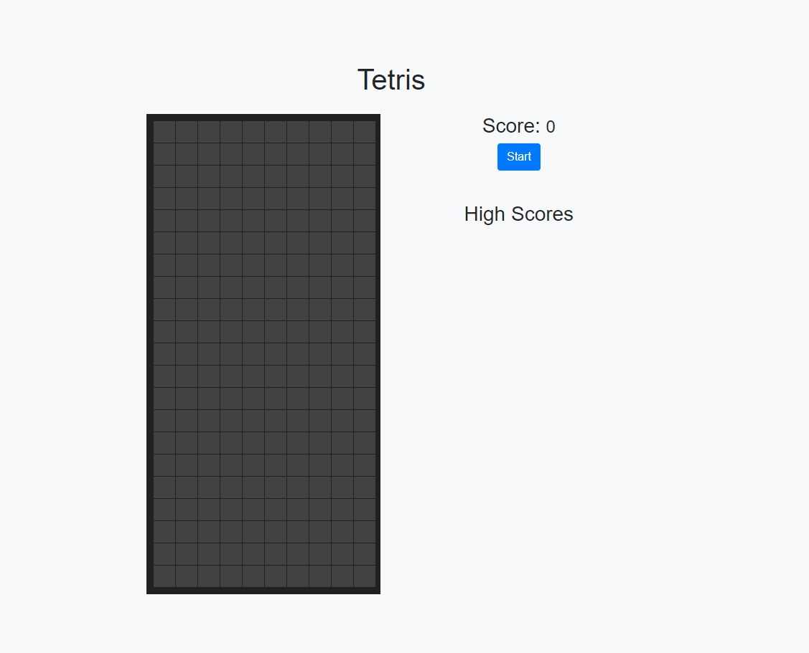

# Tetris Game

## Overview

This is a simple Tetris Game developed as a web application. The project demonstrates my skills in HTML, CSS, and JavaScript, and utilizes the Bootstrap framework for styling and layout.

## Features

- 🎮 Classic Tetris game mechanics
- 📜 Instructions for playing the game
- 📱 Responsive design for desktop and mobile
- 📈 High score tracking with local storage

## Technologies Used

- **HTML**: For structuring the game layout
- **CSS**: For styling the game and instructions
- **JavaScript**: For implementing the game logic
- **Bootstrap**: For responsive layout and styling

## How to Play

1. **Start the Game**: Click on the **Start** button to begin.
2. **Control the Tetriminos**:
   - **Desktop**: Use the arrow keys to control the Tetriminos:
     - **Left Arrow**: Move left
     - **Right Arrow**: Move right
     - **Up Arrow**: Rotate
     - **Down Arrow**: Move down faster
3. **Objective**: Complete lines to score points and prevent the Tetriminos from reaching the top of the screen.
4. **Game Over**: When the Tetriminos stack up to the top of the screen, the game is over.

## Development

1. **HTML**: Created the structure for the game using a `div` element for the game area and Bootstrap for layout.
2. **CSS**: Applied custom styles to create a visually appealing design, making use of Google colors for different Tetriminos.
3. **JavaScript**:
   - Initialized game variables and setup.
   - Implemented game mechanics including Tetrimino movement, rotation, and collision detection.
   - Added event listeners for player input and mobile responsiveness.
   - Implemented a high score feature using local storage to save and display the top scores.

### Folder Structure

├── index.html # Main HTML file
├── style.css # Custom CSS styles
└── script.js # JavaScript for game logic

## Skills Demonstrated

- **Web Development**: Utilized HTML, CSS, and JavaScript to create an interactive web application.
- **Responsive Design**: Implemented a responsive layout using Bootstrap and ensured the game works on both desktop and mobile devices.
- **Game Development**: Developed game logic including player input handling, collision detection, and game state management.
- **Local Storage**: Implemented high score tracking using local storage.

## Future Enhancements

🚀 Add different levels of difficulty.  
🏆 Implement multiplayer mode.  
📱 Improve mobile controls for a better user experience.  

## Author

Developed by Lee Sugano.
